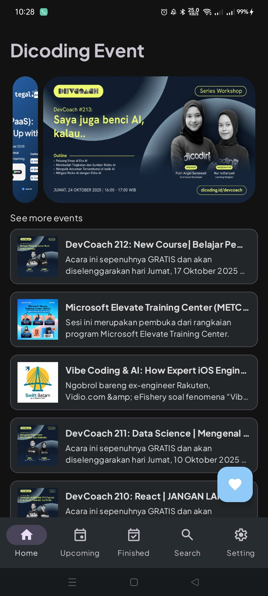
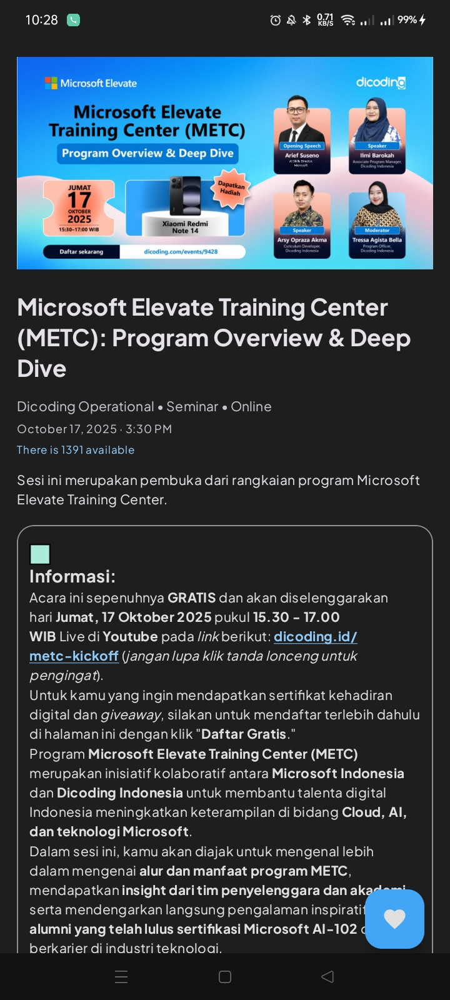

# 🎉 Eventora

[](https://kotlinlang.org/)
[](https://opensource.org/licenses/Apache-2.0)

<p align="center">
  
</p>

## 📱 Overview

Eventora is a modern Android application designed to help users discover and manage events. Built
with clean architecture principles and modern Android development practices, it provides a seamless
experience for browsing event details and more.

## 🛠 Tech Stack

### Core

- **Language**: [Kotlin](https://kotlinlang.org/)
- **Min SDK**: 27 (Android 8.1)
- **Target SDK**: 36 (Android 12)
- **Build System**: Gradle with Kotlin DSL

### Architecture & Patterns

- **MVVM** (Model-View-ViewModel)
- **Repository Pattern**
- **Dependency Injection** with Koin
- **Coroutines & Flow** for asynchronous operations
- **Navigation Component** for in-app navigation

### Libraries

- **AndroidX Core KTX** - Kotlin extensions for Android framework
- **Retrofit & Gson** - Network requests and JSON parsing
- **Coil** - Image loading
- **Lottie** - Beautiful animations
- **Timber** - Logging
- **MockK** - Testing
- **JUnit** - Unit testing

## 🏗 Project Structure

```
app/
├── src/
│   ├── main/
│   │   ├── java/com/halimjr11/eventora/
│   │   │   ├── data/           # Data layer
│   │   │   │   ├── local/      # Local data sources (Room, SharedPreferences)
│   │   │   │   ├── remote/     # Remote data sources (API services)
│   │   │   │   └── repository/ # Repository implementations
│   │   │   ├── di/             # Dependency injection modules
│   │   │   ├── domain/         # Domain layer (use cases, models)
│   │   │   └── view/           # Presentation layer
│   │   │       ├── features/   # Feature 
│   │   │       └── MainActivity.kt
│   │   └── res/                # Resources
│   └── test/                   # Unit tests
└── build.gradle.kts            # App-level build configuration
```

## 🚀 Getting Started

### Prerequisites

- Android Studio Hedgehog (2023.1.1) or later
- JDK 17
- Android SDK 36

### Installation

1. Clone the repository:
   ```bash
   git clone https://github.com/halimjr11/Eventora.git
   ```
2. Open the project in Android Studio
3. Create a `local.properties` file in the root directory if it doesn't exist
4. Add your API base URL to `local.properties`:
   ```properties
   BASE_URL=your_api_base_url_here
   ```
5. Sync the project with Gradle files
6. Build and run the app on an emulator or physical device

## 🧪 Testing

Run unit tests:

```bash
./gradlew test
```

## 📷 Screenshots

| Splash Screen                                  | Home                                         | Event Details                                  |
|------------------------------------------------|----------------------------------------------|------------------------------------------------|
|  |  |  |

## 📄 License

```
Copyright 2025 Nurhaq Halim.

Licensed under the Apache License, Version 2.0 (the "License");
you may not use this file except in compliance with the License.
You may obtain a copy of the License at

   http://www.apache.org/licenses/LICENSE-2.0

Unless required by applicable law or agreed to in writing, software
distributed under the License is distributed on an "AS IS" BASIS,
WITHOUT WARRANTIES OR CONDITIONS OF ANY KIND, either express or implied.
See the License for the specific language governing permissions and
limitations under the License.
```

## 🙏 Acknowledgments

- [Android Developers](https://developer.android.com/) for their excellent documentation
- [Kotlin](https://kotlinlang.org/) for making Android development enjoyable
- [JetBrains](https://www.jetbrains.com/) for their amazing IDEs
- [Dicoding](https://www.dicoding.com/) for their course and education
- All open-source libraries used in this project
